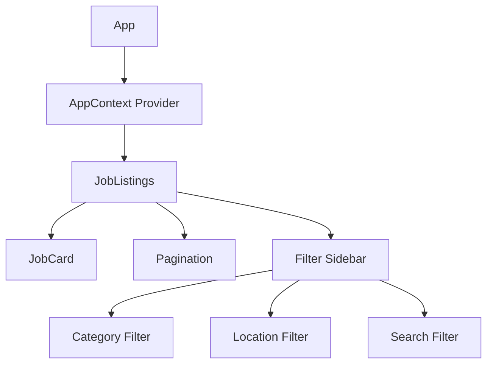

# Job Portal Component Structure

## Component Tree


## State Management

### AppContext (Global State)
```javascript
{
  isSearched: boolean,
  searchFilter: {
    title: string,
    location: string
  },
  jobs: Array<Job>,
  setSearchFilter: function
}
```

### JobListings Component
#### Local States
```javascript
{
  showFilter: boolean,        // Controls filter sidebar visibility
  selectedCategory: string[], // Selected job categories
  selectedLocation: string[], // Selected job locations
  filteredJobs: Job[],       // Filtered job results
  page: number,              // Current page number
  jobsPerPage: number        // Jobs per page (constant: 6)
}
```

#### Derived States
```javascript
{
  paginatedJobs: Job[] // Computed from filteredJobs and pagination
}
```

### JobCard Component
- Receives job data as props
- No local state
- Displays job information

### Filter Components
#### Category Filter
- Receives selectedCategory state from parent
- No local state
- Updates parent state via handleCategoryChange

#### Location Filter
- Receives selectedLocation state from parent
- No local state
- Updates parent state via handleLocationChange

#### Search Filter
- Uses searchFilter from AppContext
- No local state
- Updates via setSearchFilter from context

## Data Flow
1. Initial jobs data comes from AppContext
2. Filtering happens in JobListings component
3. Filtered results are paginated
4. Paginated results are passed to JobCard components

## State Updates
1. Filter changes trigger useEffect in JobListings
2. useEffect recalculates filteredJobs
3. Page resets to 1 on filter changes
4. Pagination updates when page changes

## Component Responsibilities
- **App**: Provides context and routing
- **JobListings**: Manages filtering and pagination
- **JobCard**: Displays individual job information
- **Filter Components**: Handle user input for filtering
- **Pagination**: Handles page navigation 